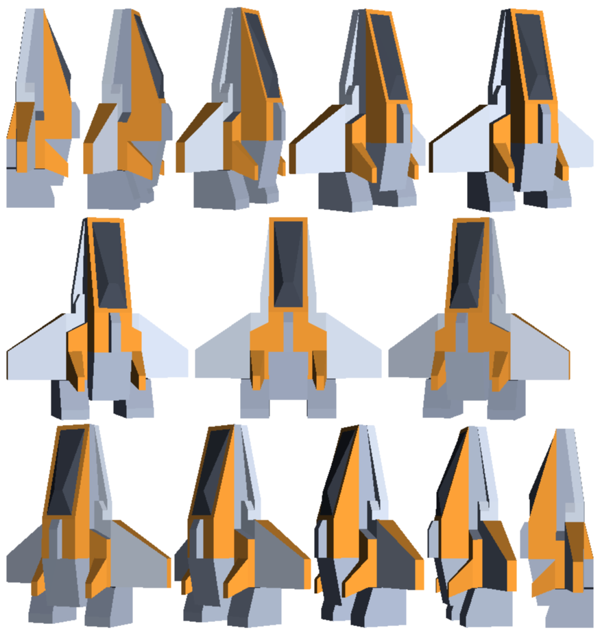
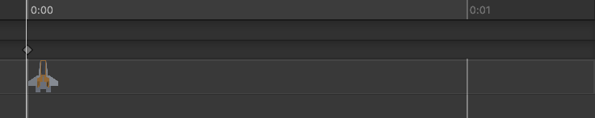
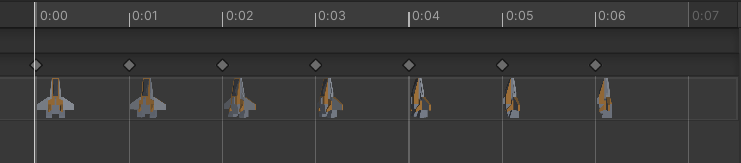
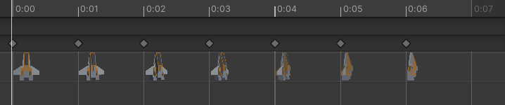

import Tabs from '@theme/Tabs';
import TabItem from '@theme/TabItem';

# Tutorial: Spritesheet Animation
One of the ways to make a game more engaging is to add animations to it. Animations can be used to make a game more visually appealing and to communicate more information to the player. For example, let's take a first person shooter with a weapon that can overheat. A UI element to show the player that the weapon is overheating would be enough, but an animation of the weapon releaseing smoke would be more interesting.

In this tutorial, we will be looking at how to implement basic spritesheet animation in Unity. Spritesheets are a collection of images where each image represents a frame in an animation sequence. Flipping through those images in sucession makes the illusion of a moving object.

## Sprite Sheet
To start, we will need a spritesheet. There are many spritesheets available online or you can create your own, but for this tutorial I generated spritesheet by taking screenshots of a 3D model in Blender. For each screenshot, I rotated the model of the player spaceship by 15 degrees and put them together in an image editor and keyed out the background. The result is a spritesheet that looks like this.



### Importing the spritesheet
To import the spritesheet, we will need to add it to the project just like a regular image. After that we will need to change some options in the import settings. First, we will need to change the **Sprite Mode** to **Multiple**, and then we will need to determine how unity should split the spritesheet into individual sprites. Press the button **Sprite Editor** to open the sprite editor. One of the options visible on the top of the sprite editor is **Slice**. Pressing this button will allow you tp determine how the spritesheet should be split. In this case, the automatic slicing is good enough, so we will just press **Slice** and then **Apply**.

### Creating an animation clip
Now that we have the spritesheet imported, we can create an animation clip. For our game, we need to three animations: one when the player moves left, one when the player moves right, and one when the player is idle. To create an animation clip, we can right click on the **Assets** folder and select **Create > Animation**. Then you can name the animation clip and double click it to open it the animation editor. 

In the animation editor, we can drag and drop the sprites from the spritesheet into the animation editor. Sometimes, the unity animation editor can be a bit buggy and it can be hard to drag and drop sprites into the animation editor. If that happens, drag and drop the spritesheet into the scene view, which will create an animation clip with the sprites in the right order. Then you can delete/reorder individual sprites in the animation editor.

Here's what the animation editor looks like for my player spaceship.

<Tabs>
<TabItem value="Idle">



</TabItem>
<TabItem value="Move Left">



</TabItem>
<TabItem value="Move Right">



</TabItem>
</Tabs>

### Animation Controller
Now that we have the animation clips, we need to create a new animation controller to determine which animation clip should be played at any given time. To create an animation controller, right click on the **Assets** folder and select **Create > Animator Controller**. Then you can name the animation controller and double click it to open it in the animation controller window..

Here, you can drag and drop the animation clips and determine which clip should be played in which state. For example, we want to start with the idle animation, so it needs to be hooked to the **Entry** node. Right clicking on any node and selecting add transition will allow you to create a transition to another state.

The real powerfulness of the system comes in when we can add parameters and determine what causes the transition between states. When I have more time I'll go into detail about how I setup the animation controller, but for now, here's what the animation controller looks like for my player spaceship.


Essentially, when the float variable move is 0, the idle animation will be played. When the float variable move is 1, the move right animation will be played and when the float variable move is -1, the move left animation will be played. I have also added "reverse" version of the animation clips, which are played at a playback speed of -1, so that the animation will transition back to idle in a smooth manner instead of jumping back to the first frame.

Another Important thing to note is that the animation clips for move left and move right are set not to loop. This is because we want the animation to stay in it's last frame when the player continues to move.

### Apply the animation
Add an `Animator` component to the player object and drag and drop the newly created animation controller into the **Controller** field. Then in the `PlayerControls` script we can modify the code to set the `move` parameter in the controller.

```csharp
Animator animator;

// in start
animator = GetComponent<Animator>();

// in update
// movement input is a float between -1 and 1 that represent the direction the player is moving
animator.SetFloat("Move", movementInput);
```

Now when you run the game, the player character should animate when you move left or right. It's very important to note that the default transitions that Unity makes are terrible for 2D spritesheets and you will need to modify and tweak the transitions to make it look good.

### Final Script
Here's the final script for the `PlayerControls` script for reference.

```csharp
using System.Collections;
using System.Collections.Generic;
using UnityEngine;

public class PlayerControls : MonoBehaviour
{
	[Tooltip("The speed at which the player ship moves")]
	public float Speed = 3;

	private Blaster blaster;
	private Animator animator;

	private void Start()
	{
		blaster = GetComponent<Blaster>();
		animator = GetComponent<Animator>();
	}

	void Update()
	{
		// variable used to track input in the current frame
		float movementInput = 0;

		// check for user movement input
		if(Input.GetKey(KeyCode.D) || Input.GetKey(KeyCode.RightArrow))
		{
			movementInput += 1;
		}

		if(Input.GetKey(KeyCode.A) || Input.GetKey(KeyCode.LeftArrow))
		{
			movementInput -= 1;
		}

		// check for shoot input
		if (Input.GetMouseButtonDown(0))
		{
			blaster.Shoot();
		}

		// apply the movement update and send the info to animator
		transform.position += Vector3.right * movementInput * Speed * Time.deltaTime;
		animator.SetFloat("Move", movementInput);
	}

	private void OnDestroy()
	{
		var uiManager = FindObjectOfType<UIManager>();
		var scoreManager = FindObjectOfType<ScoreManager>();

		scoreManager?.CheckAndUpdateHighscore();
		uiManager?.OpenGameOverMenu();
	}
}
```
