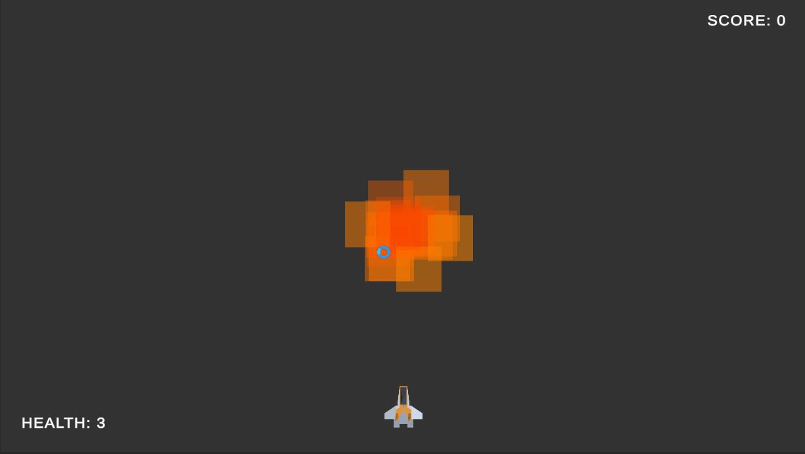

import Tabs from '@theme/Tabs';
import TabItem from '@theme/TabItem';

# Tutorial: Particle Effects
In this tutorial, we will have a brief look at the particle system in Unity. The particle system is a very powerful tool that can be used to configure and create a wide variety of effects that can add a lot of polish to your game. In this tutorial, we will be looking at how we can manipulate the particle system to create a simple explosion effect that we can use when an enemy dies.

## The Explosion Effect
Let's start by creating a new gameobject called `ExplosionVFX` and add a `Particle System` component to it. By default, it'll spawn white circular particles that will fade out over time in a conical shape. Now we need to analyze and think about how we want to achieve the explosion effect.

- We want the particles to be orange/red
- We want the spawn shape to be a sphere (so that it looks like the particles are coming from a single point of origin)
- We want the particles to be bigger

We can change the color of the particles by changing the `Start Color` property to something orange-ish or switching it to a gradient and setting the colors to fade from orange to red. We can also adjust the alpha value of the color to make the particles fade out and create an interesting effect.

We can then change the `Shape` property (under the `Shape` module) to a sphere and adjust the `Radius` property to make the particles spawn from a sphere. I set my radius to `0.1`.

We can then change the `Size over Lifetime` property to make the particles bigger. However, I was taking some creative liberty and switched the material of the particle system (under the `Renderer` module) to `Sprites-Default` which changed the shape of the particles to a square that is fairly large in size. I then changed the `Max Particle Size` to `0.35` to make the particles slightly smaller that the sprite default size.

I adjust the `Start Lifetime` to 1 and the `Start Speed` to 1 to make the particles look more like an explosion.

The end results look like this:


## Using the Effect
Now that we have the effect, we must integrate it into our game. We can drag and drop the `ExplosionVFX` gameobject into our prefabs folder to create a prefab that we can spawn in our game when an enemy dies. I'm going to add a variable called `ExplosionVFX` in our `health` script to get a reference to a GemeObject and we will spawn this GameObject when the health reaches 0.

```csharp
[SerializeField] protected GameObject ExplosionVFX = null;

// in apply damage function
// if the health drops below zero destroy the object
if (hp <= 0)
{
    // Spawn the explosion effect if available
    if(ExplosionVFX)
    {
        // the explosion effect has a self destruct which will handle destroying itself
        Instantiate(ExplosionVFX, transform.position, Quaternion.identity);
    }
}
```

I'm adding a null check to make sure that the `ExplosionVFX` is only spawned if it's available. Let's say we don't attach a VFX to the player object, then when the player dies we don't spawn an explosion effect. The last thing we to do is drag and drop the `ExplosionVFX` prefab into the `Explosion VFX` field in the `health` component of the enemy prefab.

Let's test it out and see how it looks. When the enemy dies, we should see an explosion effect. Great! But there's an issue. The explosion effect keeps playing forever and ever. We need to make sure that the effect is destroyed after a certain amount of time.

### Self Destruct
We can introduce a new script called `SelfDestruct` that will destroy the gameobject it is attached to after a certain amount of time. By keeping track of float called duration that ticks down, we can accomplish this.

```csharp
[SerializeField] float duration = 1;

void Update()
{
    duration -= Time.deltaTime;
    if(duration <= 0)
    {
        Destroy(gameObject);
    }
}
```

We can then attach this script to the `ExplosionVFX` prefab and set the duration to 0.5. Now when the enemy dies, the explosion effect will play for 0.5 seconds and then destroy itself.

## Conclusion
The particle system is very powerful and can make the game look a lot more polished. However, using it is less of a science and more of an art. Most of the time, I find myself experimenting with the various values and properties, tweaking them until I get the desired effect. Even though the system might feel a bit overwhelming at first, with a little bit of practice and experimentation, you'll be able to master it in no time. 

### Next Steps
Why not try to create a trail effect for the projectiles? Or maybe a smoke effect for the player when they take damage? The possibilities are endless.

## Final Scripts
<Tabs>
<TabItem value="SelfDestruct.cs">

```csharp
using UnityEngine;

public class SelfDestruct : MonoBehaviour
{
    [SerializeField] float duration = 1;

    void Update()
    {
        duration -= Time.deltaTime;
        if(duration <= 0)
        {
            Destroy(gameObject);
        }
    }
}
```

</TabItem>
<TabItem value="Health.cs">

```csharp
using UnityEngine;

public class Health : MonoBehaviour
{
    [SerializeField] protected int hp = 1;
    [SerializeField] protected GameObject ExplosionVFX = null;

    CameraShake cameraShake = null;

    void Start()
    {
        cameraShake = FindObjectOfType<CameraShake>();
    }

    // Apply damage to the object
    public void ApplyDamage(int damage)
    {
        hp -= damage;

        // apply camera shake as a feedback
        cameraShake.Shake(0.25f, 0.2f);

        // if the health drops below zero destroy the object
        if (hp <= 0)
        {
            // play the explosion sound effect before destroying the object
            var audioManager = FindObjectOfType<AudioManager>();
            audioManager?.PlayExplosion(transform.position);

            // Apply a larger camera shake when the enemy is killed
            cameraShake.Shake(0.4f, 0.4f);

            // Spawn the explosion effect if available
            if(ExplosionVFX)
            {
                // the explosion effect has a self destruct which will handle destroying itself
                Instantiate(ExplosionVFX, transform.position, Quaternion.identity);
            }

            // destroy the object
            Destroy(gameObject);
        }
    }

    // Apply heals to the object
    public void ApplyHeals(int heals)
    {
        // basically reverse damage
        ApplyDamage(-heals);
    }

    // Get the health from the health component
    public int GetHP() 
    {
        return hp;
    }
}

```

</TabItem>
</Tabs>
