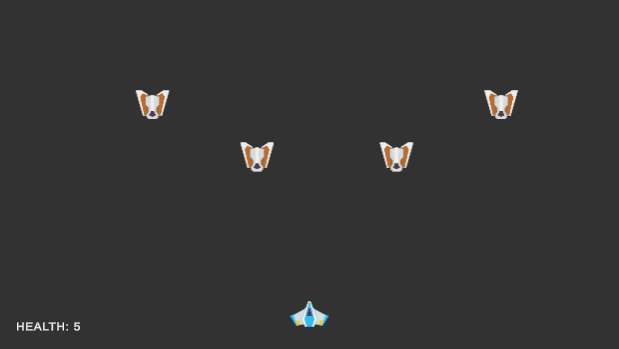
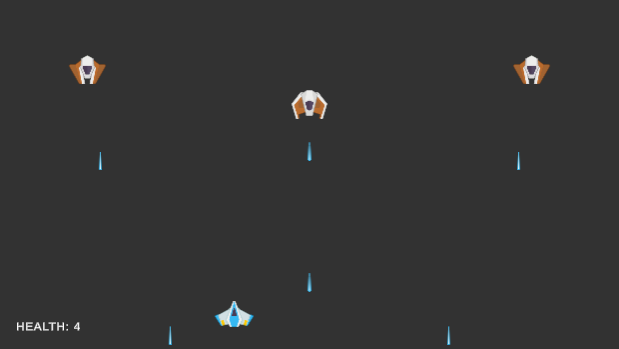
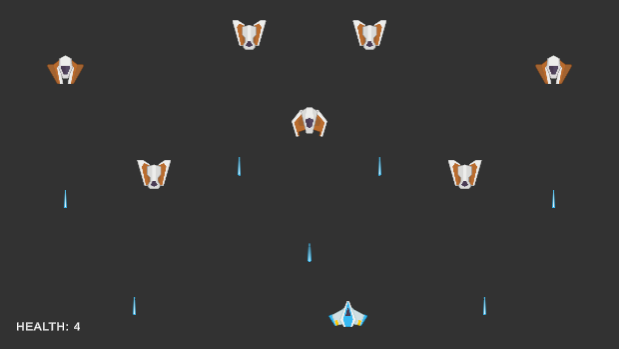

import Tabs from '@theme/Tabs';
import TabItem from '@theme/TabItem';

# Tutorial: Stages
Now that we have a simple enemies setup, we can start to add some more complexity to our game. In this tutorial, we will add a stage system to our game that will allow us to have multiple levels and automatically switch levels when the player eliminates all enemies in the current level.

## Getting Started
- In our scenes folder, let's create 3 new scenes called `Stage1`, `Stage2`, and `Stage3`
- Populate each scene with a bunch of enemies that represent an increasing difficulty level
  - Below, in the bonus section, I'll go over some tips on how to create a good difficulty curve
  - Make sure to delete the `MainCamera` from each scene
- Create a GameObject in the `CoreGameplay` scene called `GameManager`

**Here's what my scenes look like:**

<Tabs>
<TabItem value="Stage 1">



</TabItem>
<TabItem value="Stage 2">



</TabItem>
<TabItem value="Stage 3">



</TabItem>
</Tabs>

## StageManager.cs
To load levels into the current scene and manage when to switch levels, we will create a new script called `StageManager.cs`. We will attach this script to the `GameManager` object in the scene.

### Loading a scene
Using the `UnityEngine.SceneManagement` namespace, we have two different modes to load scenes into the current scene. The first is called `Single` which will unload the current scene and load the requested scene. The second is called `Additive` which will load the requested scene on top of the current scene.

```csharp
// load stage 1 using single mode
SceneManager.LoadScene("Stage1", LoadSceneMode.Single);

// load stage 1 using additive mode
SceneManager.LoadScene("Stage1", LoadSceneMode.Additive);
```

We will use the `Additive` method to just load the enemies into the current scene. This will allow us to keep the player and camera in the scene and not have to reload them every time we switch levels.

### Tracking stages
To switch stages, we need to keep track of the current stages as well as a list of all the stages in the game. The stages can be represented as strings, so we will create a list of strings to hold the names of the stages. The current stage will be represented by an integer that will be used to index into the list of stages.

```csharp
[Tooltip("A list of all the stages in the game")]
[SerializeField] List<string> scenes;

// we start with index 0, which is the first stage in the list
int currentSceneID = 0;
```

### Tracking enemies
We will also need to keep track of the number of enemies in the current scene. We can do this by creating a variable to hold the number of enemies and initializing it by counting the number of enemies in the scene. We need to do this as soon as the scene is loaded.

```csharp
int enemiesLeft = 0;
enemiesLeft = FindObjectsOfType<EnemyAI>().Length;
```

To track the number of enemies left in the scene, we will need to create a public function that will decrement the number of enemies left and we will call this function from the `EnemyAI` script when an enemy is destroyed.

*In StageManager.cs:*
```csharp
// Report to the stage manager that an enemy was killed
public void ReportEnemyDeath()
{
    enemiesLeft--;
}
```

*In EnemyAI.cs:*
```csharp
void OnDestroy()
{
    // get a reference to the stage manager and report that this enemy was destroyed
    var stageManger = FindObjectOfType<StageManager>();
    stageManger?.ReportEnemyDeath();
}
```

### Switching stages
Now that we have all the building blocks in place, we can create the logic to switch stages. As soon as there are no more enemies left in the scene, we will load the next stage in the list. We will also add an additional condition that will check and ignore the switch if we are in the last stage.

```csharp
void Update()
{
    // if there are no enemies left, we can switch to the next stage
    if(enemiesLeft == 0 && currentSceneID < scenes.Count)
    {
        SceneManager.LoadScene(scenes[currentScenID], LoadSceneMode.Additive);
        enemiesLeft = FindObjectsOfType<EnemyAI>().Length;
        currentSceneID++;
    }
}
```

### Bug Fixing

Let's test out our stage manager by running the game. We would immediately notice that something is wrong and that all the stages are loaded at the same time. This is because `LoadScene` is not a synchronous function and `enemiesLeft` will remain 0 until the next frame. To fix this, we will use the `async` version of the `LoadScene` function. I'll also create a custom local function to handle this for manageability.

```csharp
void LoadEnemyScene(string scenename)
{
    var asyncLoad = SceneManager.LoadSceneAsync(scenename, LoadSceneMode.Additive);
    asyncLoad.completed += (AsyncOperation op) => 
    {
        enemiesLeft = FindObjectsOfType<EnemyAI>().Length;
    };
}
```

What we are doing here is creating an `AsyncOperation` object that will load the scene in the background, and as soon as the scene is loaded, it will call the completed callback and update the number of enemies in the scene. There is one last issue that we need to fix. The enemy count will remain 0 until the stage is loaded and our update loop will switch to the next frame. So, temporarily, we will set the enemy count to something impossible like -1 so that we can prevent the stage from switching until the requested scene is loaded.

```csharp
void Update()
{
    // if there are no enemies left, we can switch to the next stage
    if(enemiesLeft == 0 && currentSceneID < scenes.Count)
    {
        enemiesLeft = -1;
        LoadEnemyScene(scenes[currentSceneID]);
        currentSceneID++;
    }
}
```

### An edge case
There is one edge case that we need to handle. What if the designer decides to add an enemy to the default scene manually instead of loading it from an additive scene? We need to account for this and update the enemy count accordingly during the script initialization.

```csharp
void Start()
{
    enemiesLeft = FindObjectsOfType<EnemyAI>().Length;
}
```

Now, if the an enemy is added to the scene, it gets accounted for and blocks the stage from switching.

### Final Script
Here is the final script for the `StageManager.cs` and `EnemyAI.cs` scripts.

<Tabs>
<TabItem value="StageManager.cs">

```csharp
using System.Collections;
using System.Collections.Generic;
using UnityEditor;
using UnityEngine;
using UnityEngine.SceneManagement;

// Script responsible for adding new enemies from the next stage to the current scene once player has
// cleared all enemies in the current stage
public class StageManager : MonoBehaviour
{
    [SerializeField] List<string> scenes;

    int currentSceneID = 0;
    int enemiesLeft = 0;

    void Start()
    {
        enemiesLeft = FindObjectsOfType<EnemyAI>().Length;
    }

    void Update()
    {
        // if there are no enemies left, we can switch to the next stage
        if(enemiesLeft == 0 && currentSceneID < scenes.Count)
        {
            enemiesLeft = -1;
            LoadEnemyScene(scenes[currentScenID]);
            currentSceneID++;
        }
    }

    void LoadEnemyScene(string scenename)
    {
        var asyncLoad = SceneManager.LoadSceneAsync(scenename, LoadSceneMode.Additive);
        asyncLoad.completed += (AsyncOperation op) => 
        {
            enemiesLeft = FindObjectsOfType<EnemyAI>().Length;
        };
    }

    // Report to the stage manager that an enemy was killed
    public void ReportEnemyDeath()
    {
        enemiesLeft--;
    }
}
```

</TabItem>
<TabItem value="EnemyAI.cs">

```csharp
using UnityEngine;

[RequireComponent(typeof(Blaster))]
public class EnemyAI : MonoBehaviour
{
    [Tooltip("How frequently should the enemy fire a projectile (given in seconds)")]
    [SerializeField] protected float fireRate = 1;

    [Tooltip("How much time to wait before firing")]
    [SerializeField] protected float startWaitTime = 0;

    [Header("Simple movement")]
    [Tooltip("How fast should the enemy travel in terms units/seconds")]
    [SerializeField] protected float moveSpeed = 1;

    [Tooltip("How far should the the enemy move")]
    [SerializeField] protected float WiggleRoom = 1;

    [Tooltip("The direction in which the enemy AI should currently move")]
    [SerializeField] protected bool MoveRight = true;

    // A private reference to the blaster that the enemy can shoot from
    protected Blaster blaster;

    // this variable is used to track how many seconds have elapsed since last fired
    protected float fireTimer = 0;

    // the position that anchor's the enemy
    protected Vector3 anchor;

    void Start()
    {
        // since we are using the RequireComponent attribute, we are guaranteed to have a blaster
        blaster = GetComponent<Blaster>();

        // set the anchor position so that the enemy can move left and right relative to it
        anchor = transform.position;
    }

    void Update()
    {
        // elapse the start wait time if it hasn't elapsed
        if(startWaitTime > 0)
        {
            startWaitTime -= Time.deltaTime;
        }

        // increment the timer
        fireTimer += Time.deltaTime;

        // if the timer has elapsed, shoot from the blaster and reset the timer
        if(fireTimer >= fireRate && startWaitTime <= 0)
        {
            blaster.Shoot();
            fireTimer = 0;
        }

        // move the player in the expected direction
        Vector3 move = MoveRight ? transform.right : -transform.right;
        transform.position += move * Time.deltaTime * moveSpeed;

        // do the check to toggle the direction once they have travelled pass the bounds
        if (Vector3.Distance(anchor, transform.position) > WiggleRoom / 2)
        {
            MoveRight = !MoveRight;
        }
    }

    void OnDestroy()
    {
        // get a reference to the stage manager and report that this enemy was destroyed
        var stageManger = FindObjectOfType<StageManager>();
        stageManger?.ReportEnemyDeath();
    }
}
```

</TabItem>
</Tabs>

## Bonus: Difficulty Curves
The way we have set up our enemies, we can adjust multiple properties that can help us adjust the difficulty of the game in a variety of ways. The simplest way to increase difficulty is by increasing the number of enemies in each stage. The more enemies are present the harder it is for a player to defeat the level.

The next way to increase difficulty is by increasing the rate at which the enemies fire. This can be adjusted by changing the `fireRate` variable in the `EnemyAI` component. The lower the value, the faster the enemy will fire. An enemy who can fire faster will decrease the chance of the player being able to dodge the projectiles and will increase the difficulty of the game.

Another way to increase difficulty is by increasing the speed of the enemy movement by adjusting the `moveSpeed` variable in the `EnemyAI` component. The faster the enemy moves, the harder it is for the player to hit the enemy with their projectiles. We can also adjust how far the enemy can move by adjusting the `WiggleRoom` variable. The larger the wiggle room, the more the enemy can move left and right.

Finally, we can adjust the difficulty of a stage by increasing the health of the enemies. This can be done by adjusting the `hp` variable in the `Health` component. The higher the health, the more damage the player will need to apply to the enemy to eliminate it.

With all of this in mind, we can create an interesting difficulty curve for our game. We can start with a few enemies that fire slowly and have low health. As the game progresses, we can increase the number of enemies, increase the rate at which they fire, increase their health, and increase their movement speed. By managing these variables, we can control the intensity of the game.